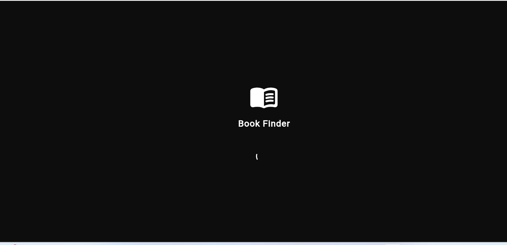

# book_finder

A new Flutter project.

## HR Tasks

### Task 1
Task 1 Screenshot](assets/screenshots/task1.png)

### Task 2
Task 2 Screenshot](assets/screenshots/task2.png)

### Task 3
Task 3 Screenshot](assets/screenshots/task3.png)

### Task 4
](assets/screenshots/task4.png)

---

## Getting Started

This project is a starting point for a Flutter application.

A few resources to get you started if this is your first Flutter project:

- [Lab: Write your first Flutter app](https://docs.flutter.dev/get-started/codelab)
- [Cookbook: Useful Flutter samples](https://docs.flutter.dev/cookbook)

For help getting started with Flutter development, view the
[online documentation](https://docs.flutter.dev/), which offers tutorials,
samples, guidance on mobile development, and a full API reference.
